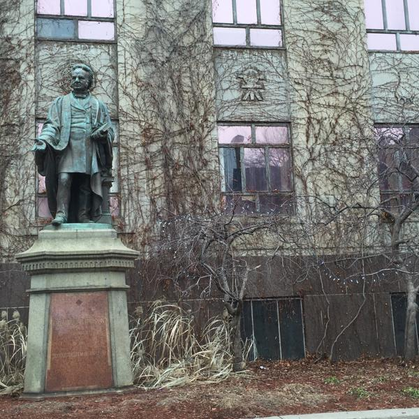
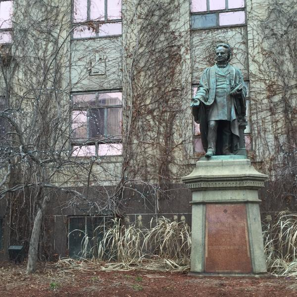
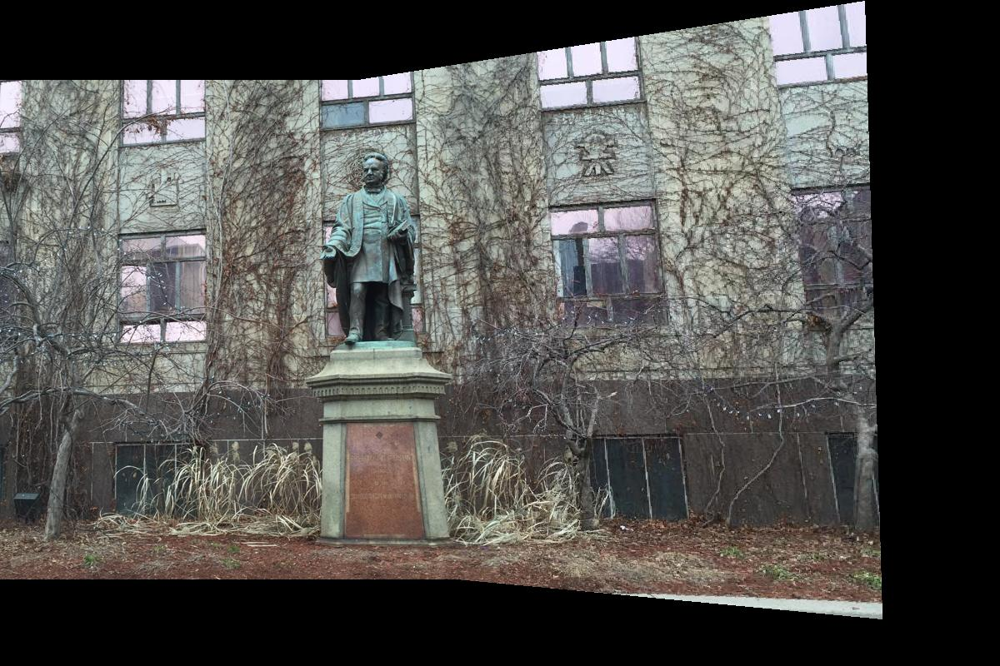

# Panoramas with Affine/Homography Transformations and RANSAC

## Note: [vlfeat](http://www.vlfeat.org/install-matlab.html) must be installed, since [SIFT](https://en.wikipedia.org/wiki/Scale-invariant_feature_transform) is used to find keypoint descriptors.

This repository is split into two different parts. The general functionality is mostly the same between the two (SIFT for keypoint detection, [RANSAC](https://en.wikipedia.org/wiki/Random_sample_consensus) for robustness to outliers). The largest difference is that a homography (unlike an affine transformation) can not be solved with the pseudo-inverse, so SVD of the homogeneous matrix is necessary to estimate a transformation. Other than the use of the homogeneous matrix and SVD, both algorithms are pretty much the same, so the code between them is very similar.

Examples:

 

